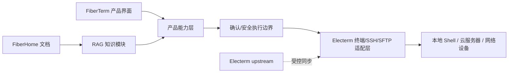

# FiberTerm 总体架构

## 架构原则

FiberTerm 采用“稳定上游底座 + 隔离的产品能力层”路线。现阶段不复制或替换 Electerm 核心，而是在清晰边界后增加 FiberTerm 模块。

## 现有底座

优先复用：

- Electron 主进程、渲染进程和 IPC 框架。
- xterm 终端、PTY、SSH、SFTP、标签页和书签。
- AI 配置、Ask/Agent 会话、工具调用循环和聊天历史。
- 终端缓冲区读取、状态检测、取消与后台任务原型。

## FiberTerm 产品能力层

逐步建设：

- 展示层品牌与企业设置。
- AI 动作提议、风险评估、审批和结构化结果。
- FiberHome 设备命令适配与设备上下文。
- 产品手册、命令参考和故障案例检索。
- 审计、策略管理和受控自动化。

## RAG 知识模块

RAG 是独立的深模块，向 Ask 和 Agent 暴露窄接口，隐藏文档解析、切片、embedding、混合检索、重排、引用和索引迁移。主接口为 `ingestDocuments`、`searchKnowledge`、`listDocuments`、`removeDocument` 和 `rebuildIndex`。

Ask 在调用聊天模型前检索并构造带引用的上下文，但只输出回答，不调用执行工具；用户可自行复制或显式点击既有运行按钮。Agent 通过只读工具 `search_fiberhome_knowledge` 主动检索，并且只有 Agent 可以继续调用终端工具。两条路径共享同一个知识模块，不各自实现检索逻辑；RAG 接入不得改变 Ask/Agent 原有权限语义。

首版复用 Electron 主进程和 IPC，采用纯 JavaScript 词法索引以降低 Windows 打包风险；同时用小型 Spike 验证 Electron 实际运行时的 `node:sqlite`/FTS5 能力，再决定是否切换长期索引实现。文档解析与索引运行在主进程侧，渲染进程只负责选择文件、展示状态和引用。具体存储实现由适配器隔离，避免 UI 和 Agent 依赖数据库结构。

## 模块边界

- 展示品牌不得改变内部包名、应用 ID 或用户数据路径。
- AI、Ask 和 MCP 不得直接绕过执行网关写入终端。
- 底层终端适配器负责“如何执行”，策略层负责“是否允许执行”。
- 企业知识只提供上下文，不能直接授权高风险操作。
- 检索到的文档内容视为不可信输入，不得覆盖系统指令或申请工具权限。
- 对上游核心文件的修改应尽量窄，并通过专项测试固定兼容行为。

## 当前已知状态

- 基线：Electerm `v3.15.186`，提交 `e5bf0f9a`。
- 产品集成主线：`codex/smartterm-main`，当前仍等同于基线。
- 品牌实现位于 `codex/branding-name`，尚未合并，等待后续视觉补充和用户验收。
- AI 执行研究已经完成；执行网关尚未实现。

更细的 AI 调用链和风险证据见 [AI 命令执行研究](research/ai-command-execution-study.md)。
