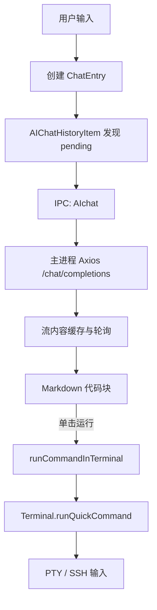
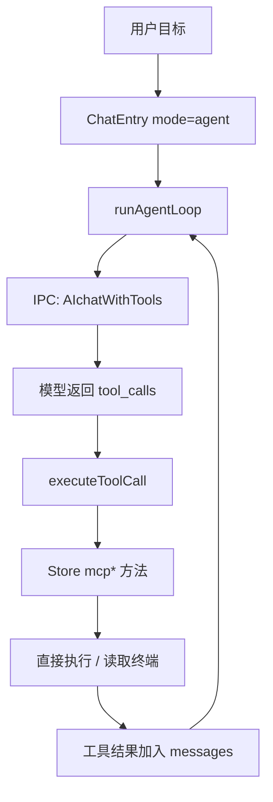
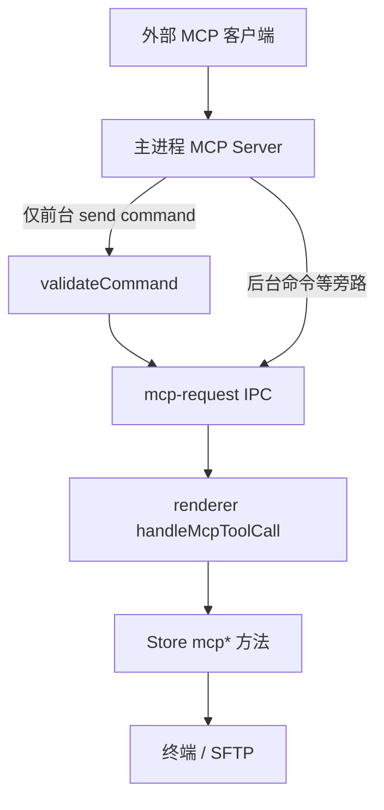
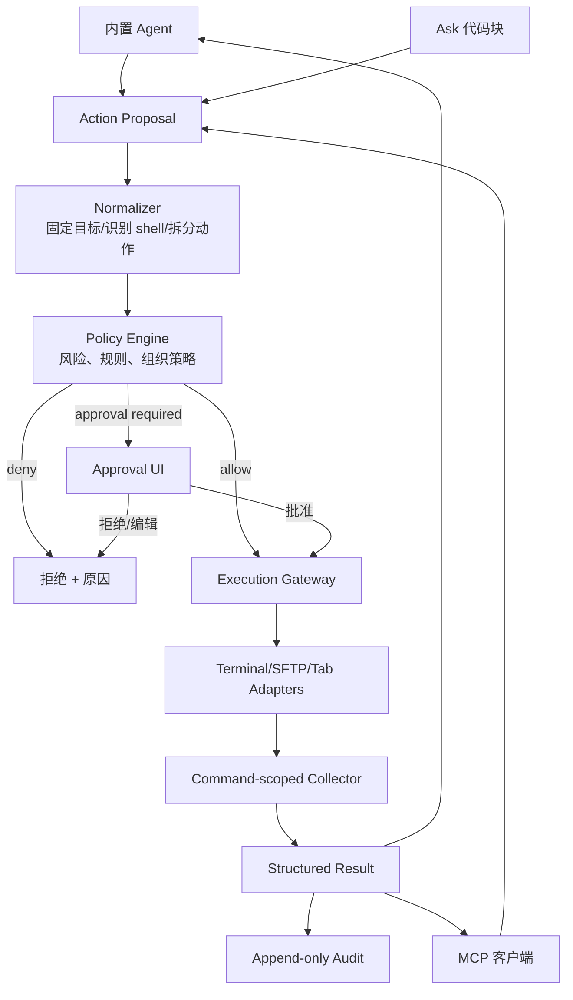

# Electerm AI 命令执行现状与安全闭环改造研究

> 研究基线：`codex/ai-execution-research`，提交 `e5bf0f9a`（Electerm v3.15.186）<br>
> 研究日期：2026-08-01<br>
> 证据范围：仅本仓库源码、测试和仓库文档；未使用互联网资料。<br>
> 文中“现状”是源码事实，“判断”是基于源码的工程判断，“建议”是拟议设计，不代表已经实现。

## 1. 执行摘要

Electerm 已具备比“AI 聊天框”更完整的基础设施：Ask/Agent 双模式、OpenAI 兼容的工具调用请求、最多 150 轮的 Agent 循环、终端命令注入、终端缓冲区读取、4 秒无输出判定、密码提示检测、后台任务和会话历史持久化。README 也明确把 AI 助手定位为命令建议、脚本编写和终端内容解释能力（`README_cn.md:67-68`）。

但它**尚未形成可用于企业运维的安全执行闭环**。当前最高优先级问题是执行入口分裂：

1. 内置 Agent 收到模型 `tool_calls` 后，立即调用 `executeToolCall()`；`send_terminal_command` 随即进入 `store.mcpSendTerminalCommand()`，没有风险分类、用户审批或统一策略检查（`src/client/components/ai/agent.js:120-166`；`src/client/components/ai/agent-tools.js:448-458`）。
2. MCP 的前台命令工具有独立 `validateCommand()` 黑白名单，但只在 MCP Server 的 `send_electerm_terminal_command` 注册处理器中调用（`src/app/widgets/widget-mcp-server.js:121-187,317-338`）。内置 Agent 不经过该类，因此会绕过这套规则。
3. MCP 自身的 `run_electerm_background_command` 也未调用 `validateCommand()`，直接转给渲染进程（`src/app/widgets/widget-mcp-server.js:431-448`）。仓库测试甚至记录了黑名单匹配不到包装后命令、只验证“不崩溃”的现状（`test/unit/mcp-widget.spec.js:591-628`）。
4. Ask 模式返回的代码块带“运行”图标，单击后直接向已选终端发送命令，同样没有风险说明或二次确认（`src/client/components/ai/ai-output.jsx:39-95`；`src/client/store/common.js:255-259`）。

因此，**不建议直接在现有 `executeToolCall()` 上叠加一张确认弹窗**。第一阶段应先建立一个内置 Agent、Ask 代码块和 MCP 共同使用的 `Execution Gateway`（执行网关），将策略评估、审批、执行、结果归集和审计变为唯一入口。否则新增 UI 只能保护其中一条路径，其余路径仍可绕过。

决策建议：

- 现有 Agent 循环、工具定义、终端访问、缓冲区读取、会话 UI 可以复用。
- 现有 `validateCommand()` 只能作为新策略引擎的一条兼容规则，不能继续作为 MCP 私有安全边界。
- **P0（开工门槛）**：统一执行入口；默认所有改变状态的动作都需批准；危险动作二次确认；所有入口都必须经过相同策略。
- **P1（首个可用版本）**：结构化命令卡片、命令级输出边界、退出码/超时状态、审计记录和 Agent 可靠停止。
- **P2（后续增强）**：组织策略、批准记忆、批量设备策略、敏感输出脱敏与可验证的 shell integration。

## 2. 现有能力清单

| 能力 | 当前实现 | 可用程度 |
|---|---|---|
| AI 配置 | 支持 API URL、路径、模型、API Key、自定义认证头、代理、角色和语言；预设覆盖 OpenAI、DeepSeek 等 OpenAI 兼容端点（`src/client/components/ai/ai-config.jsx:198-308`；`src/client/components/ai/ai-config-props.js:1-109`） | 可复用 |
| Ask/Agent 模式 | 输入区提供 Ask/Agent 切换；Agent 运行时禁止再次提交（`src/client/components/ai/ai-chat.jsx:27-54,148-163,228-254`） | 可复用 UI |
| 多轮会话 | 以 `chatSessionId` 分组，支持新会话、加载、删除、清空和压缩摘要（`src/client/components/ai/ai-chat.jsx:34-44,95-133`；`src/client/store/common.js:270-427`） | 可复用 |
| 普通聊天流式输出 | 主进程发起 HTTP 流，渲染进程每 200ms 轮询内容，支持停止流（`src/app/lib/ai.js:80-186`；`src/client/components/ai/ai-chat-history-item.jsx:93-159,190-205`） | 可复用，但不是 Agent 流式 |
| Agent 工具调用 | 非流式 Chat Completions 请求携带 `tools`，模型返回 `tool_calls`，循环执行并回送工具结果（`src/app/lib/ai.js:58-78`；`src/client/components/ai/agent.js:75-168`） | 功能存在，安全不足 |
| 终端命令执行 | `runQuickCommand()` 最终通过终端 attach addon 发送 `cmd + \r`（`src/client/store/quick-command.js:60-63`；`src/client/components/terminal/terminal.jsx:474-479`） | 可复用底层适配器 |
| 输出采集 | 从 xterm active buffer 读取最近 N 行；等待终端进入 idle 后返回尾部输出（`src/client/store/mcp-handler.js:562-674`） | 可复用原型，需命令边界 |
| 状态与密码提示 | 输出到达使标签进入 `feed`，4 秒后清空；密码提示进入 `password`（`src/client/components/tabs/tab.jsx:35-85`）；attach addon 用多语言正则和回显探测密码提示（`src/client/components/terminal/attach-addon-custom.js:120-175,236-249`） | 可复用信号，不应等同命令完成 |
| 取消命令 | 可向终端发送 Ctrl+C（`src/client/store/mcp-handler.js:721-738`） | 可复用 |
| 后台任务 | `nohup bash`、日志/PID/退出码文件和内存任务表（`src/client/store/mcp-handler.js:741-790`） | Linux/SSH 定向；策略缺失 |
| 工具调用展示 | 工具卡显示名称、参数、状态和结果（`src/client/components/ai/agent-tool-call-card.jsx:25-89`） | 可复用展示骨架 |
| AI/终端历史 | AI 历史和终端命令历史是独立数据库；AI 历史会被自动监听并持久化（`src/client/common/db.js:23-51`；`src/client/store/watch.js:22-68`） | 有记录，无审计语义 |
| 数据静态加密 | SQLite/NeDB 都把 `aiChatHistory` 列为静态加密表（`src/app/lib/sqlite.js:12-19,93-123`；`src/app/lib/nedb.js:10-17,77-113`） | 可复用 |
| MCP 外部接入 | 本地主进程 MCP Server 通过 IPC 调渲染进程；可选 API Key，默认绑定 127.0.0.1（`src/app/widgets/widget-mcp-server.js:22-100,189-215`） | 可复用，但需统一策略 |

## 3. 端到端调用链

### 3.1 Ask 模式：聊天与手动运行代码



1. 提交时创建包含 prompt、模式、会话、AI 配置和时间戳的 `chatEntry`，压入 `aiChatHistory`（`src/client/components/ai/ai-chat.jsx:56-93`）。
2. 历史项首次挂载时清除 `pending`；Ask 模式调用 `AIchat`（`src/client/components/ai/ai-chat-history-item.jsx:120-188`）。
3. `AIchat` 通过主进程 IPC 白名单暴露（`src/app/lib/ipc.js:72,208-212`），主进程用 Axios 调 OpenAI 兼容接口（`src/app/lib/ai.js:32-55,80-160`）。
4. 流式结果存入主进程内存 `streamingSessions`，渲染进程每 200ms 读取（`src/app/lib/ai.js:7-30,118-186`；`src/client/components/ai/ai-chat-history-item.jsx:93-118`）。
5. Markdown 围栏代码显示运行图标；点击后过滤空行和 `#` 注释，然后直接执行（`src/client/components/ai/ai-output.jsx:39-95`）。若选择了多个终端，会对 `batchInputSelectedTabIds` 中每个终端发送相同命令（`src/client/store/common.js:255-259`）。

### 3.2 Agent 模式：模型自动调用工具



1. Agent 和 Ask 共享 `chatEntry`；差别只由 `mode` 字段决定（`src/client/components/ai/ai-chat.jsx:62-84`）。
2. 历史项依据 `mode === 'agent'` 调 `runAgentLoop()`（`src/client/components/ai/ai-chat-history-item.jsx:161-188`）。
3. Agent 系统提示声称“执行前解释”，但这是提示词约定，不是代码强制控制（`src/client/components/ai/agent.js:6-25`）。
4. 每轮主进程请求携带完整 `messages` 和 `agentTools`，非流式等待模型（`src/client/components/ai/agent.js:36-47,75-104`；`src/app/lib/ai.js:58-73`）。
5. 对每个 `tool_call`，代码先把状态记为 `running`，随后立即执行，成功/失败后才更新卡片并把结果作为 `role: tool` 回送模型（`src/client/components/ai/agent.js:120-167`）。
6. `send_terminal_command` 直接调用 `mcpSendTerminalCommand()`，然后等待 idle 并读取最近 100 行（`src/client/components/ai/agent-tools.js:448-459`）。这里没有策略或审批调用。

### 3.3 MCP 外部调用链



1. MCP Server 在主进程注册工具，通过 `mcp-request` 发送到渲染进程并等待 `mcp-response`（`src/app/widgets/widget-mcp-server.js:189-215`；`src/client/store/mcp-handler.js:21-35,190-199`）。
2. 只有 `send_electerm_terminal_command` 的注册处理器显式调用 `validateCommand()`（`src/app/widgets/widget-mcp-server.js:317-338`）。
3. 渲染进程的 `handleMcpToolCall()` 只做工具分派，不做通用策略（`src/client/store/mcp-handler.js:34-200`）。
4. 最终 `mcpSendTerminalCommand()` 只校验 tab 和 command 是否存在，然后调用 `runQuickCommand()`（`src/client/store/mcp-handler.js:520-539`）。

## 4. 数据模型与状态

### 4.1 当前 ChatEntry

源码实际字段（`src/client/components/ai/ai-chat.jsx:62-84`）：

```text
ChatEntry {
  id, timestamp, chatSessionId,
  prompt, response,
  mode: ask | agent,
  pending, isStreaming, sessionId,
  toolCalls[],
  nameAI, modelAI, roleAI, baseURLAI, apiPathAI,
  apiKeyAI, proxyAI, languageAI, authHeaderNameAI,
  compressed?, flagged?
}
```

工具调用记录是 `{ id, name, args, status, result }`，状态只有 `running | completed | error`（`src/client/components/ai/agent.js:136-160`；`src/client/components/ai/agent-tool-call-card.jsx:36-56`）。它没有风险等级、审批状态、策略命中、目标设备快照、开始/完成时间、退出码或操作者信息。

全局状态只有 `agentRunning` 布尔值，没有按会话/工具划分的运行对象（`src/client/store/init-state.js:92-95`）。这使并发、恢复、精确取消和跨窗口协调都很难表达。

### 4.2 持久化与历史

- `aiChatHistory` 是独立 DB，启动时加载，变化时逐项写回（`src/client/store/load-data.js:223-245`；`src/client/store/watch.js:22-68`）。
- 它保存 prompt、模型响应、工具参数与工具结果，也保存 `apiKeyAI`，但表级数据由 OS safe storage 加密（`src/client/components/ai/ai-chat.jsx:72-82`；`src/app/lib/sqlite.js:12-19,114-123`）。
- 会话历史最多 500 个条目（`src/client/components/ai/ai-chat.jsx:25,87-92`），支持压缩摘要但不会删除原条目（`src/client/store/common.js:300-397`）。
- 终端命令历史是另一套数据。用户按 Enter 时手工解析当前行写历史；启用 OSC 633 shell integration 时由 shell 回报命令写历史（`src/client/components/terminal/terminal.jsx:1218-1234,1477-1500`）。AI 的 `runQuickCommand()` 直接调用 attach addon，不触发 xterm `onData`；因此在没有 shell integration 的终端上，AI 注入命令不能可靠进入终端命令历史（`src/client/components/terminal/terminal.jsx:474-479,1510`）。

结论：当前“历史”是聊天恢复数据，不是防篡改审计日志；也不能可靠关联一次提议、审批、实际命令、目标终端、输出和结果。

## 5. UI 交互现状

- AI 面板底部提供 Ask/Agent 分段选择；Ask 模式可选择目标终端，Agent 模式隐藏终端选择并默认使用活动终端（`src/client/components/ai/ai-chat.jsx:135-146,228-254`）。
- Agent 工具卡只显示执行后的参数、状态和结果，没有“执行/编辑/取消”动作（`src/client/components/ai/agent-tool-call-card.jsx:60-89`）。
- Agent 运行时只禁用新的 Agent 提交；停止按钮把 `abortRef` 设为 true（`src/client/components/ai/ai-chat.jsx:31-32,148-163`；`src/client/components/ai/ai-chat-history-item.jsx:190-216`）。由于 Agent 在 `await executeToolCall()` 期间不会检查该标记，停止 AI 不等于停止已经发出的终端命令（`src/client/components/ai/agent.js:120-167`）。
- Ask 代码块的运行按钮无命令说明、风险等级和确认，并可能批量发往多个已选标签页（`src/client/components/ai/ai-output.jsx:55-88`；`src/client/store/common.js:255-259`）。
- AI 命令建议下拉的选择行为只把建议填入当前命令行，不自动按 Enter（`src/client/components/terminal/terminal-command-dropdown.jsx:217-255`）；这是现有交互中可保留的安全做法。

## 6. 后端 IPC 与 AI 请求

主进程 `AIchatWithTools` 是一个薄代理：构造自定义认证头和代理 agent，向用户配置的 `baseURL + path` POST `{model,messages,stream:false,tools}`，返回第一条 choice 的 message（`src/app/lib/ai.js:32-78`）。它没有：

- 工具白名单按用户/会话裁剪；
- 请求和工具执行关联 ID；
- 输出长度/敏感信息处理；
- 模型响应 schema 的严格校验；
- 供应商超时、重试或费用控制；
- 策略和审批状态。

IPC 只负责把 `AIchat`、`AIchatWithTools` 等函数加入全局异步调用表（`src/app/lib/ipc.js:72,208-212`）。当前安全决策散落在调用者，不在 IPC 或统一服务边界。

## 7. 命令执行与输出采集

### 7.1 执行

所有前台执行最终都收敛到 `Terminal.runQuickCommand()`，它向当前终端连接发送命令字符串和回车（`src/client/components/terminal/terminal.jsx:474-479`）。优点是复用现有 PTY/SSH/Telnet 交互通道；缺点是：

- 不天然得到进程 ID、退出码、stdout/stderr 分离；
- 命令与终端上的用户输入、提示符、后台输出共享一条流；
- 活动标签页可能在模型思考期间发生变化；
- 交互式命令、密码/确认提示会悬挂。

### 7.2 输出和完成判定

`mcpGetTerminalOutput()` 从 xterm active buffer 的 `baseY + cursorY` 向前取 N 行（`src/client/store/mcp-handler.js:562-607`）。`mcpWaitForTerminalIdle()` 每 500ms 查看标签页 `terminalOnData`，输出停止 4 秒后视为完成，超时最长 120 秒，并返回当时的 buffer 尾部（`src/client/store/mcp-handler.js:609-674`；`src/client/components/tabs/tab.jsx:53-70`）。

这不是命令级采集，存在以下误判：

- 4 秒没有输出不等于进程退出；安静运行的命令会被提前判定完成。
- 持续输出、常驻进程或等待输入的程序会超时，但 Agent 仍可能继续推理。
- 返回内容可能含上一次命令、提示符和其他并发输出，也可能因只取尾部而截断关键错误。
- 没有退出码；虽有 `CommandTrackerAddon.lastExitCode`，当前 Agent/MCP 等待逻辑未使用它（`src/client/components/terminal/command-tracker-addon.js:98-118,174-193`）。
- attach addon 在持续大流量时会丢弃最旧的未刷新数据以保护 UI，说明 xterm 可视缓冲不适合作为完整审计输出（`src/client/components/terminal/attach-addon-custom.js:26-50`）。

建议保留 buffer 读取作为兼容回退，但首选 shell integration 的命令开始/结束标记；对本地终端可评估专用 exec 通道，对 SSH 优先复用独立 exec 能力。执行结果必须显式表达 `completed | failed | timed_out | cancelled | waiting_input | unknown`，不能把 idle 等同 success。

## 8. 当前安全机制及其边界

### 8.1 已有机制

- 企业可通过 `mandatoryGuardrails` 给所有 AI system prompt 追加文本（`src/client/components/ai/ai-guardrails.js:1-10`）。
- MCP 前台命令含内置危险正则、用户黑名单和白名单（`src/app/widgets/widget-mcp-server.js:121-187`）。
- MCP 可选 API Key；默认只监听 127.0.0.1（`src/app/widgets/widget-mcp-server.js:30-49`）。
- 书签列表对密码、私钥、跳板和隧道等字段做过滤（`src/client/store/mcp-handler.js:202-225`）。
- AI 历史静态加密（`src/app/lib/sqlite.js:12-19,93-123`）。

### 8.2 风险分级

| 级别 | 风险 | 证据与影响 |
|---|---|---|
| **P0** | 内置 Agent 自动执行无审批且绕过 MCP `validateCommand()` | `runAgentLoop()` 直接 `executeToolCall()`（`src/client/components/ai/agent.js:120-166`），后者直调 store（`src/client/components/ai/agent-tools.js:448-515`）。模型或提示注入可直接触发破坏性命令/SFTP 删除。 |
| **P0** | MCP 后台命令绕过自身命令校验 | 注册处理器未调用 `validateCommand()`（`src/app/widgets/widget-mcp-server.js:431-448`）；测试只确认黑名单命令“不崩溃”（`test/unit/mcp-widget.spec.js:591-628`）。 |
| **P0** | 安全规则仅靠正则且分散在入口 | 黑名单只覆盖少量 Unix 形式（`src/app/widgets/widget-mcp-server.js:121-137`），无法可靠覆盖 PowerShell、cmd、编码/间接执行、重定向、脚本文件、SFTP 删除和组合命令。 |
| **P1** | Ask 代码块单击直接执行，缺少风险说明；批量目标不醒目 | `src/client/components/ai/ai-output.jsx:55-88`；`src/client/store/common.js:255-259`。 |
| **P1** | “停止 Agent”不能中断在途工具/命令 | 停止只设置标志，工具执行 await 期间不检查（`src/client/components/ai/ai-chat-history-item.jsx:190-205`；`src/client/components/ai/agent.js:120-167`）。 |
| **P1** | idle 被当作命令完成且没有退出码/输出边界 | `src/client/store/mcp-handler.js:609-674`。可能给模型错误成功信号并诱发下一步操作。 |
| **P1** | 工具参数与结果持久化但缺少脱敏 | 工具卡和历史保存原始 args/result（`src/client/components/ai/agent.js:136-166`）；表虽加密，解密后的 UI/导出/诊断仍可能暴露 token、配置和终端秘密。 |
| **P2** | 提示词 guardrail 可被模型忽略 | `appendMandatoryGuardrails()` 只拼接文本（`src/client/components/ai/ai-guardrails.js:4-10`），不构成强制策略。 |
| **P2** | 无不可抵赖审计、策略版本和批准人信息 | 当前 `ChatEntry/toolCalls` 模型不含相关字段（`src/client/components/ai/ai-chat.jsx:62-84`；`src/client/components/ai/agent.js:136-142`）。 |

## 9. 已知缺口

1. 无统一动作模型：命令、SFTP 删除、开关标签页、创建书签等都直接映射工具函数，无法统一判定“读/写/危险”。
2. 无计划/批准状态机：工具调用只有 running/completed/error，没有 proposed/awaiting_approval/rejected/cancelled。
3. 无稳定目标快照：省略 `tabId` 时执行时才读取 activeTab，模型请求后切换标签可能执行到错误设备（`src/client/components/ai/agent-tools.js:451-457`；`src/client/store/mcp-handler.js:520-533`）。
4. 无命令规范化与 shell 上下文：同一文本在 Bash、PowerShell、cmd、设备 CLI 上风险不同。
5. 无命令级输出、退出码和起止标记；当前结果是屏幕尾部快照。
6. 无敏感内容分级/脱敏/长度上限，工具输出原样回传第三方模型。
7. 无在途工具取消协议；Agent 最多 150 轮，错误后可能继续自修复执行（`src/client/components/ai/agent.js:4,18-21,75-175`）。
8. 无 Agent 专项测试；现有 AI E2E 只验证 Ask 聊天、新会话和 UI（`test/e2e/006.ai-chat.spec.js:40-79`）。

## 10. 可复用模块

| 模块 | 建议 |
|---|---|
| `agent.js` 循环 | 保留“模型—工具结果—模型”的循环，但把执行改为提交 `ActionProposal`，等待网关返回批准/拒绝/结果；降低默认轮数并加入总动作预算。 |
| `agent-tools.js` 工具 schema | 保留只读工具；改变状态的工具只生成提议，不直接访问 store。 |
| `AgentToolCallCard` | 升级为命令/动作卡片，增加目的、目标、风险、策略依据、编辑、批准、拒绝和执行结果。 |
| `mcp-handler.js` 终端适配器 | 保留 tab 解析、buffer 读取、Ctrl+C 等底层能力，移到执行网关之后，避免暴露为可绕过的公共执行入口。 |
| `CommandTrackerAddon` | 复用 OSC 633 的命令和退出码信号，新增执行 correlationId 和起止等待器。 |
| `validateCommand()` | 抽出内置/用户规则作为策略引擎的一层输入；补充结构化动作、shell、目标和组织策略，避免把正则当完整安全方案。 |
| `aiChatHistory` DB | 继续用于对话恢复；另建追加式 audit 数据模型，不把聊天记录冒充审计。 |
| MCP IPC | 保留传输，但所有变更型 MCP 工具也必须进入同一网关。 |

## 11. 推荐目标架构



### 11.1 核心契约

```text
ActionProposal {
  id, source: agent | ask | mcp,
  sessionId, actor,
  actionType: terminal.command | sftp.delete | ...,
  targetSnapshot: { tabId, title, host, type, shell, cwd },
  payload: { command, ... },
  purpose,
  createdAt
}

PolicyDecision {
  risk: low | medium | high | critical,
  effect: allow | require_approval | deny,
  reasons[], matchedRules[], policyVersion,
  approvalMode: none | single | double
}

ExecutionResult {
  proposalId, executionId,
  status: completed | failed | timed_out | cancelled | waiting_input | unknown,
  exitCode?, stdout?, stderr?, outputTruncated,
  startedAt, finishedAt, targetSnapshot
}
```

关键约束：

- `Execution Gateway` 是所有改变状态动作的唯一入口；底层 adapter 不再由 Agent/MCP/UI 直接调用。
- 策略对来源无差别：同一动作无论来自内置 Agent、Ask 还是 MCP，得到同一风险判断。
- 只读也必须记录；第一版可允许明确的只读命令单击批准，不能默认无感执行。
- 批量目标按“目标数量”提升风险并在卡片中完整列出。
- 编辑命令会生成新 proposal，并重新评估，不能沿用旧批准。
- 模型只能看到结构化、脱敏和限长后的 `ExecutionResult`。

### 11.2 第一版风险规则

| 等级 | 示例 | 默认决策 |
|---|---|---|
| 低 | `pwd`、`whoami`、`df -h`、`show version` 等明确只读 | 显示卡片，单击执行；可选“本次会话允许同类只读” |
| 中 | 创建文件、安装依赖、修改非关键配置、写入书签 | 明确批准 |
| 高 | 删除/覆盖、权限修改、服务重启、网络配置、SFTP 删除、批量执行 | 二次确认，显示影响范围 |
| 严重 | 磁盘格式化、递归删除根/家目录、关闭安全控制、无法界定目标 | 默认拒绝；策略管理员显式放行才可执行 |

风险规则必须同时包含：结构化动作类型、shell-aware token/AST（可逐步实现）、目标环境和组织规则。正则仅作为快速拦截层。

## 12. 分阶段改造计划

### 阶段 0：封闭执行旁路（P0，最先完成）

范围：不改 AI 能力，只建立唯一入口。

- 新建 `ActionProposal`、`PolicyDecision`、`ExecutionGateway` 纯逻辑模块。
- 将 MCP `validateCommand()` 规则迁入共享 Policy Engine。
- Agent `executeToolCall()`、Ask 代码运行、MCP 前台/后台命令全部改走网关。
- 默认策略：只读需一次点击；写操作需批准；已知严重动作拒绝。
- 底层 `mcpSendTerminalCommand()` 标记为 adapter/private，禁止 UI/Agent/MCP 直接调用。

验收：对同一危险命令，从三种入口调用均得到相同拒绝；后台命令不可绕过；未批准时 PTY/SSH 零写入。

### 阶段 1：命令卡片与批准状态机（首个用户可体验版本）

- 把工具卡升级为 `proposed → awaiting_approval → executing → terminal` 状态机。
- 展示命令、用途、目标终端、风险、理由；支持执行、编辑、取消。
- 高风险二次确认；批量目标逐项列出。
- 批准锁定 proposal 哈希、目标快照和策略版本；任何编辑必须重新评估。

验收：用户可在执行前完整看见动作；目标切换不会改变已批准目标；编辑后旧批准失效。

### 阶段 2：结果闭环与可靠取消

- 优先用 OSC 633 起止/exitCode；无集成时使用带随机标记的包装命令；仍无法可靠判断时明确返回 `unknown`。
- 输出按 executionId 切片，限长、标记截断并脱敏。
- Agent 停止同时取消待审批动作；执行中提供 Ctrl+C/适配器取消，并等待结果状态收敛。
- 密码/交互提示转为 `waiting_input`，禁止模型自行填写秘密。

验收：成功、非零退出、超时、取消、等待密码分别得到准确状态；输出不混入前一条命令。

### 阶段 3：审计与策略管理

- 新建追加式审计表，记录 proposal、decision、approval、execution、result 的关联 ID、哈希、操作者和策略版本。
- 提供按会话、设备、风险、时间过滤与导出。
- 增加企业 guardrail 配置 UI；文本提示词和强制策略分开显示。

验收：任一执行都能从用户目标追溯到实际命令、批准人、目标、结果；删除聊天不删除审计。

### 阶段 4：受控自动化

- 仅在用户显式开启的会话中允许低风险只读自动执行。
- 增加每会话动作数、耗时、输出量和费用预算。
- 组织策略、角色权限和设备分组；高风险始终不自动批准。

## 13. 测试策略

### 13.1 单元测试（每次提交运行）

- Policy Engine：Linux/PowerShell/cmd/网络设备 CLI 基本分类；白名单、黑名单、组织规则优先级；编码/空白/组合命令；无效规则 fail-closed。
- Proposal：目标快照、稳定哈希、编辑后哈希变化、批准过期。
- 状态机：所有合法迁移及非法迁移；并发批准、取消、超时。
- 脱敏：API Key、密码、私钥、Bearer token、常见设备 secret。
- 适配器契约：未提供有效 approval token 时不能调用 `_sendData()`。

### 13.2 集成测试

- 三入口一致性矩阵：Agent、Ask、MCP × 低/中/高/严重 × 前台/后台。
- 验证 P0 回归：`rm -rf /`、PowerShell 删除、SFTP 删除、后台包装命令均不可绕过。
- 模拟 xterm/OSC：命令开始、结束、退出码、混杂输出、截断、长时间静默、密码提示。
- 取消传播：等待审批、模型请求中、终端执行中分别取消。
- 审计：每个 terminal 状态都生成完整关联链，且不写敏感明文。

### 13.3 E2E 小步验收

1. 只读命令卡片：不点击不执行；点击后结果回填。
2. 编辑命令：风险重新计算，旧批准失效。
3. 高风险：二次确认；取消后终端无输入。
4. Agent 闭环：生成命令→批准→执行→解释非零退出，不自动继续危险修复。
5. MCP 同策略：外部工具调用也能在应用内弹出批准并等待。
6. 重启恢复：未完成执行标记为 interrupted/unknown，不自动重放。

现有测试可继续作为基线：MCP `validateCommand()` 已有纯单元和 HTTP 测试（`test/unit/mcp-widget.spec.js:1-10,137-260,352-455`），普通 AI 聊天有 E2E（`test/e2e/006.ai-chat.spec.js:40-79`）。需要新增 Agent 工具调用 mock；现有 `test/e2e/common/ai-api.js` 只返回文本，不生成 `tool_calls`（`test/e2e/common/ai-api.js:46-143`）。

## 14. 风险与非目标

### 实施风险

- 终端类型差异：Bash/PowerShell/cmd/设备 CLI 很难一次性做完准确解析，应先“保守分类 + 用户批准”，再逐步提高自动识别率。
- shell integration 并非所有终端可用，必须保留明确标注不确定性的回退路径，不能伪造成功。
- 将 MCP 改为等待应用内批准可能改变外部客户端超时行为，需要可续期请求/异步状态查询。
- 历史数据模型变更要兼容旧 `toolCalls`，不能在迁移时重放或错误标为已批准。
- 批量终端执行影响面大，第一版建议禁止 Agent 自动批量并要求逐目标确认。

### 本轮非目标

- 不在本研究分支修改任何产品代码。
- 不一次性实现完整知识库、设备知识、批量运维或团队 RBAC。
- 不承诺用静态正则准确理解任意 shell 命令。
- 不在第一版允许高风险无人值守执行。
- 不以聊天历史替代合规审计，也不承诺防御已获得本机管理员权限的攻击者。

## 15. 待决问题

1. 第一版是否坚持“所有命令都点一次执行”，还是允许明确只读命令在用户开启会话级授权后自动执行？建议先全部点击。
2. MCP 调用需要同步等待批准，还是返回 `approvalRequestId` 由客户端轮询？建议异步 ID，避免 HTTP/IPC 长时间占用。
3. Windows PowerShell/cmd、本地 Bash、SSH Bash 和网络设备 CLI 的首批支持优先级是什么？这会决定命令采集与分类适配器顺序。
4. 严重风险是永久拒绝，还是允许管理员策略解锁？建议首版永久拒绝。
5. 审计保存周期、导出格式和谁有权清理？需要产品/合规决策。
6. 模型是否允许看到完整终端输出？建议默认限长并脱敏，用户可手动扩大范围。
7. SFTP 删除、书签修改、关闭标签页等非 shell 动作是否纳入首版统一卡片？建议至少把 SFTP 删除纳入 P0，其他逐步接入。

## 16. 最终结论

Electerm 的现有代码已经证明“AI 能操作终端”在技术上可行，最有价值的资产是 Agent 循环、工具 schema、终端适配、xterm 输出读取和会话 UI。真正缺少的不是再加一个执行按钮，而是**不可绕过的统一决策与执行边界**。

下一步最小而专业的开发切片应是：

> **先建立统一 Execution Gateway，并让内置 Agent、Ask 代码块、MCP 前台命令和 MCP 后台命令全部经过它；随后只交付一张可审批的单命令卡片。**

这个切片直接封堵当前 P0 旁路，同时最大限度复用现有模块，也为后续风险分级、结果解释、审计和知识库提供稳定接口。
